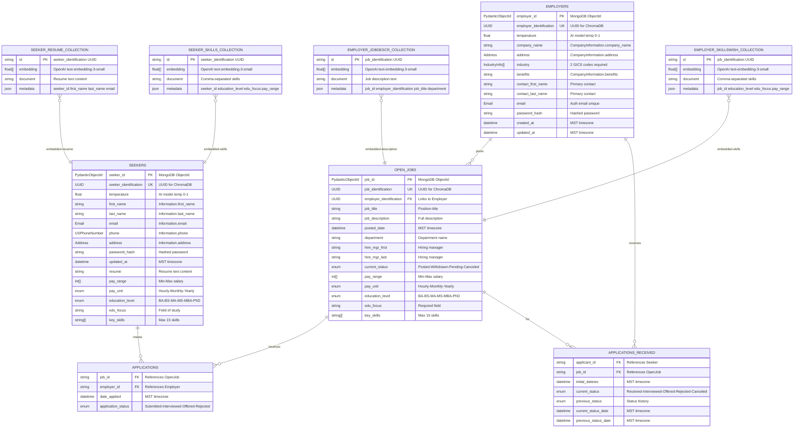

# Job Portal Entity Relationship Diagram (ERD)

This diagram shows the MongoDB collections (Seekers, Employers) and ChromaDB vector collections for the Job Portal application.

## Mermaid ERD

## Database Architecture Overview

### MongoDB Collections (Document Store)

#### 1. SEEKERS Collection
**Purpose**: Stores job seeker profiles, resumes, and application history

**Key Fields**:
- `seeker_id` (PydanticObjectId): Primary key for MongoDB
- `seeker_identification` (UUID): Unique identifier used to link with ChromaDB collections
- `temperature` (float): AI model temperature setting (0.0-1.0, default: 0.75)
- `information`: Nested object containing personal details
  - `first_name`, `last_name`
  - `email` (validated Email type)
  - `phone` (validated USPhoneNumber type)
  - `address` (validated Address type)
- `password_hash`: Bcrypt hashed password
- `resume`: Full resume text content (also stored in ChromaDB for vector search)
- `pay_range`: Array of two integers [min, max]
- `pay_unit`: Enum ("Hourly", "Monthly", "Yearly")
- `education_level`: Enum ("BA", "BS", "MA", "MS", "MBA", "PhD")
- `edu_focus`: Field of study or specialization
- `key_skills`: Array of strings (max 15 items)
- `applications`: Array of Application subdocuments
- `updated_at`: Last update timestamp (MST timezone)

**Indexes**:
- `information.email` (for authentication)
- `updated_at` (for sorting)

---

#### 2. EMPLOYERS Collection
**Purpose**: Stores employer/company profiles, job postings, and received applications

**Key Fields**:
- `employer_id` (PydanticObjectId): Primary key for MongoDB
- `employer_identification` (UUID): Unique identifier used to link with ChromaDB collections
- `temperature` (float): AI model temperature setting (0.0-1.0, default: 0.75)
- `company_information`: Nested object containing company details
  - `company_name`: Official company name
  - `address`: Validated Address type
  - `industry`: Array of exactly 2 IndustryInfo objects (GICS codes)
  - `benefits`: Company benefits description
- `contact_first_name`, `contact_last_name`: Primary contact person
- `email`: Contact email (validated Email type, unique)
- `password_hash`: Bcrypt hashed password
- `created_at`, `updated_at`: Timestamps (MST timezone)
- `open_jobs`: Array of OpenJob subdocuments
- `apps_received`: Array of ApplicationReceived subdocuments

**Indexes**:
- `email` (for authentication)
- `company_information.company_name` (for search)
- `created_at` (for sorting)
- `open_jobs.job_id` (for job lookups)

---

### MongoDB Subdocuments

#### 3. OPEN_JOBS (Embedded in EMPLOYERS)
**Purpose**: Individual job postings created by employers

**Key Fields**:
- `job_id` (PydanticObjectId): Unique job identifier for MongoDB
- `job_identification` (UUID): Unique identifier used to link with ChromaDB collections
- `employer_identification` (UUID): Foreign key linking to parent employer
- `job_title`: Position title
- `job_description`: Full job description (also stored in ChromaDB for vector search)
- `posted_date`: When the job was posted (MST timezone)
- `department`: Department name
- `hire_mgr_first`, `hire_mgr_last`: Hiring manager name
- `current_status`: Enum ("Posted", "Withdrawn", "Pending", "Canceled")
- `pay_range`: Array of two integers [min, max]
- `pay_unit`: Enum ("Hourly", "Monthly", "Yearly")
- `education_level`: Required education level
- `edu_focus`: Required field of study
- `key_skills`: Array of required skills (max 15 items, also stored in ChromaDB)

---

#### 4. APPLICATIONS (Embedded in SEEKERS)
**Purpose**: Tracks applications submitted by job seekers

**Key Fields**:
- `job_id`: Reference to OpenJob (foreign key)
- `employer_id`: Reference to Employer (foreign key)
- `date_applied`: Application submission timestamp (MST timezone)
- `application_status`: Enum ("Submitted", "Interviewed", "Offered", "Rejected")

---

#### 5. APPLICATIONS_RECEIVED (Embedded in EMPLOYERS)
**Purpose**: Tracks applications received by employers with candidate status

**Key Fields**:
- `applicant_id`: Reference to Seeker (foreign key)
- `job_id`: Reference to OpenJob (foreign key)
- `initial_daterec`: When application was first received (MST timezone)
- `candidate_tracking`: Nested CandidateTracking object
  - `current_status`: Enum ("Received", "Interviewed", "Offered", "Rejected", "Canceled")
  - `previous_status`: Previous status value
  - `current_status_date`: Timestamp of current status (MST timezone)
  - `previous_status_date`: Timestamp of previous status (MST timezone)

---

### ChromaDB Collections (Vector Store)

All ChromaDB collections use **OpenAI's text-embedding-3-small** model for generating vector embeddings. These collections enable semantic search and AI-powered matching between job seekers and employers.

#### 6. SEEKER_RESUME_COLLECTION
**Purpose**: Vector embeddings of job seeker resumes for semantic search

**Structure**:
- `id`: `seeker_identification` (UUID from Seeker document)
- `embedding`: Float array (vector embedding of resume text)
- `document`: Full resume text content
- `metadata`: JSON object containing:
  - `seeker_id`: MongoDB ObjectId (as string)
  - `first_name`: Seeker's first name
  - `last_name`: Seeker's last name
  - `email`: Seeker's email

**Use Case**: Find resumes semantically similar to job descriptions

---

#### 7. SEEKER_SKILLS_COLLECTION
**Purpose**: Vector embeddings of job seeker skills for skill-based matching

**Structure**:
- `id`: `seeker_identification` (UUID from Seeker document)
- `embedding`: Float array (vector embedding of skills)
- `document`: Comma-separated list of skills
- `metadata`: JSON object containing:
  - `seeker_id`: MongoDB ObjectId (as string)
  - `education_level`: Highest education level
  - `edu_focus`: Field of study
  - `pay_range`: Desired salary range

**Use Case**: Match seeker skills with job requirements using semantic similarity

---

#### 8. EMPLOYER_JOBDESCR_COLLECTION
**Purpose**: Vector embeddings of job descriptions for semantic search

**Structure**:
- `id`: `job_identification` (UUID from OpenJob subdocument)
- `embedding`: Float array (vector embedding of job description)
- `document`: Full job description text
- `metadata`: JSON object containing:
  - `job_id`: MongoDB ObjectId (as string)
  - `employer_identification`: Employer's UUID
  - `job_title`: Position title
  - `department`: Department name

**Use Case**: Find jobs semantically similar to seeker profiles/resumes

---

#### 9. EMPLOYER_SKILLSWISH_COLLECTION
**Purpose**: Vector embeddings of required job skills for skill-based matching

**Structure**:
- `id`: `job_identification` (UUID from OpenJob subdocument)
- `embedding`: Float array (vector embedding of required skills)
- `document`: Comma-separated list of required skills
- `metadata`: JSON object containing:
  - `job_id`: MongoDB ObjectId (as string)
  - `education_level`: Required education level
  - `edu_focus`: Required field of study
  - `pay_range`: Salary range offered

**Use Case**: Match job requirements with seeker skills using semantic similarity

---

## Relationships

### MongoDB Relationships
1. **SEEKERS → APPLICATIONS**: One-to-Many
   - Each seeker can have multiple applications
   - Applications are embedded within the Seeker document

2. **EMPLOYERS → OPEN_JOBS**: One-to-Many
   - Each employer can post multiple jobs
   - Jobs are embedded within the Employer document

3. **EMPLOYERS → APPLICATIONS_RECEIVED**: One-to-Many
   - Each employer receives multiple applications
   - Applications are embedded within the Employer document

4. **OPEN_JOBS ↔ APPLICATIONS**: Logical relationship via `job_id`
   - Applications reference jobs using `job_id`
   - This creates a many-to-many relationship between seekers and jobs

### ChromaDB Relationships
1. **SEEKERS ↔ SEEKER_RESUME_COLLECTION**: One-to-One
   - Linked via `seeker_identification` (UUID)

2. **SEEKERS ↔ SEEKER_SKILLS_COLLECTION**: One-to-One
   - Linked via `seeker_identification` (UUID)

3. **OPEN_JOBS ↔ EMPLOYER_JOBDESCR_COLLECTION**: One-to-One
   - Linked via `job_identification` (UUID)

4. **OPEN_JOBS ↔ EMPLOYER_SKILLSWISH_COLLECTION**: One-to-One
   - Linked via `job_identification` (UUID)

---

## ID Schema

### Primary Keys (MongoDB)
- **Seekers**: `seeker_id` (PydanticObjectId - MongoDB auto-generated)
- **Employers**: `employer_id` (PydanticObjectId - MongoDB auto-generated)
- **OpenJobs**: `job_id` (PydanticObjectId - MongoDB auto-generated)

### UUID Identifiers (ChromaDB)
- **Seekers**: `seeker_identification` (UUID4 - generated on creation)
- **Employers**: `employer_identification` (UUID4 - generated on creation)
- **OpenJobs**: `job_identification` (UUID4 - generated on creation)

**Why Two ID Types?**
- MongoDB uses `PydanticObjectId` (BSON ObjectId) for efficient document lookups
- ChromaDB requires string IDs, so we use UUID4 for uniqueness and compatibility
- UUIDs enable cross-database references and distributed system compatibility

---

## Timezone Configuration

**All datetime fields use MST (Mountain Standard Time)** - `America/Denver` timezone

This includes:
- `Seeker.updated_at`
- `Employer.created_at`, `Employer.updated_at`
- `OpenJob.posted_date`
- `Application.date_applied`
- `ApplicationReceived.initial_daterec`
- `CandidateTracking.current_status_date`, `CandidateTracking.previous_status_date`
- ChromaDB collection metadata creation timestamps

---

## AI/ML Integration

### Temperature Setting
Both Seeker and Employer documents include a `temperature` field (float, 0.0-1.0, default: 0.75) used for AI model inference control:
- Lower values (0.0-0.3): More deterministic/conservative responses
- Medium values (0.4-0.7): Balanced creativity and consistency
- Higher values (0.8-1.0): More creative/diverse responses

### Vector Embeddings
ChromaDB collections store OpenAI embeddings for:
- **Semantic Search**: Find similar resumes, jobs, and skills
- **Recommendation Engine**: Match seekers with relevant jobs
- **Skill Matching**: AI-powered skill compatibility analysis
- **Natural Language Queries**: Allow users to search using natural language

---

## Data Validation

### Custom Validators (from `backend.utils.validators`)
- **Email**: Validates email format
- **USPhoneNumber**: Validates US phone number format
- **Address**: Validates complete address (street, city, state, zip_code)

### Industry Classification (GICS)
- **IndustryInfo**: Validates GICS codes (2, 4, 6, or 8 digits)
- Employers must provide exactly 2 industry classifications
- GICS code validation via `backend.utils.gics_helper.is_valid_gics_code()`

### Constraints
- **key_skills**: Maximum 15 items (both Seeker and OpenJob)
- **pay_range**: Exactly 2 elements [min, max]
- **industry**: Exactly 2 IndustryInfo elements for employers
- **password_hash**: Minimum 6 characters (pre-hashed)

---

## Collection Indexes

### SEEKERS
- `information.email`: Unique index for authentication
- `updated_at`: For sorting and filtering

### EMPLOYERS
- `email`: Unique index for authentication
- `company_information.company_name`: For company search
- `created_at`: For sorting
- `open_jobs.job_id`: For job lookups

---

## File Locations

- **Schemas**: `backend/schemas/seeker.py`, `backend/schemas/employer.py`
- **Database Setup**: `backend/db/settings.py`
- **ChromaDB Operations**: `backend/db/chroma_crud_ops.py`
- **Service Layer**: `backend/services/seeker_services.py`, `backend/services/employer_services.py`

---

## Notes

1. **Dual Database Architecture**: 
   - MongoDB stores structured data with ACID compliance
   - ChromaDB stores vector embeddings for AI-powered semantic search

2. **Embedded Documents**: 
   - Applications, Jobs, and Candidate Tracking are embedded (not separate collections)
   - This design optimizes for read performance and maintains data locality

3. **UUID Bridge**: 
   - UUID fields connect MongoDB documents with ChromaDB collections
   - Enables efficient cross-database queries and relationships

4. **Status Tracking**: 
   - Applications have different status enums on Seeker side vs Employer side
   - Employers have more detailed candidate tracking with status history

5. **Timezone Consistency**: 
   - All timestamps use MST (America/Denver) for consistency
   - Requires `zoneinfo` module (included in Python 3.9+, needs `tzdata` package on Windows)

---

*Generated: 2025-11-15*  
*Project: Job Portal - Greenfield Project*  
*Database: MongoDB + ChromaDB (OpenAI Embeddings)*

